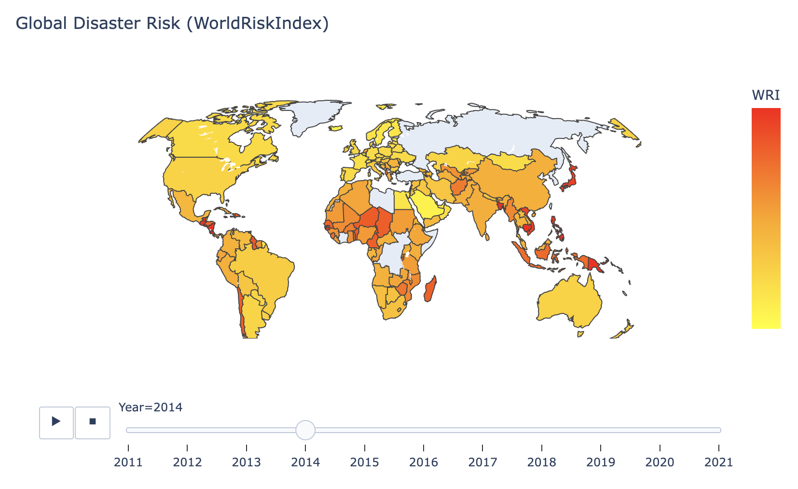

# World Climate Risk Index Visualization

This project presents an interactive data visualization of the **World Risk Index (WRI)** using Python and Plotly. The goal is to support public understanding of global disaster risks through engaging, accessible, and informative visual analytics.

## Project Overview

- **Title:** World Risk Index Visualization: Exploring Global Disaster Vulnerability
- **Author:** Zichu Zhou
- **Course:** INFOSCI 301
- **Instructor**: Luyao Zhang

## Objectives

- Visualize the global distribution of World Risk Index (WRI) scores.
- Allow filtering and exploration of key sub-indicators:
  - Exposure
  - Vulnerability
  - Susceptibility
- Apply principles of **information design**, **accessibility**, and **emotional engagement** in visualization.

## Result Preview

