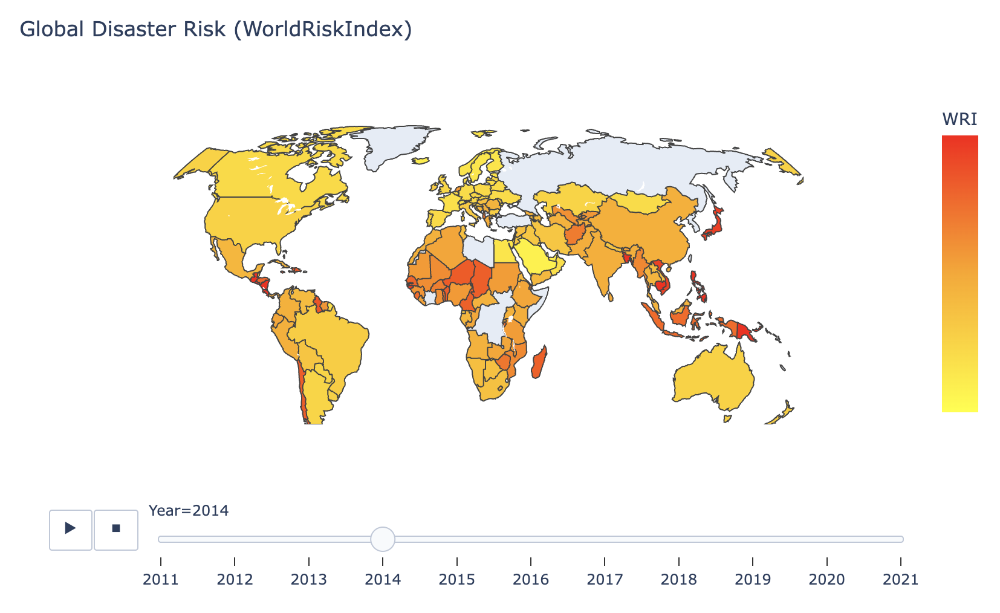

# World Climate Risk Index Visualization

This project presents an interactive data visualization of the **World Risk Index (WRI)** using Python and Plotly. The goal is to support public understanding of global disaster risks through engaging, accessible, and informative visual analytics.

## Project Overview

- **Title:** World Risk Index Visualization: Exploring Global Disaster Vulnerability
- **Author:** Zichu Zhou
- **Course:** INFOSCI 301
- **Instructor**: Luyao Zhang

## Objectives

- Visualize the global distribution of World Risk Index (WRI) scores.
- Allow filtering and exploration of key sub-indicators:
  - Exposure
  - Vulnerability
  - Susceptibility
- Apply principles of **information design**, **accessibility**, and **emotional engagement** in visualization.

## Redesign Goals

This project is a redesign of a static infographic, with the following improvements:

- Added **interactive filtering** by risk components
- Ensured **color perceptual accuracy** and accessibility
- Included **metadata clarity** (hover labels, country codes)
- Enhanced **usability** for policymakers and researchers

## Result Preview

## Theoretical Grounding

This redesign is inspired by core principles from **Edward Tufte**, **Jacques Bertin**, and **Tamara Munzner**:

- **Data-Ink Ratio** (Tufte): Maximized data presence and minimized non-essential ink.
- **Perceptual Optimization** (Munzner, 2014): Used position and color (hue and intensity) for effective quantitative data encoding.
- **Cognitive Load Reduction** (Fekete & Plaisant, 1999): Improved labeling, tooltips, and removed clutter.
- **Color Theory & Accessibility**: Applied colorblind-safe palettes to enhance inclusiveness.

## Research Inspiration

Inspired by the IEEE VIS Best Paper:  
**"Affective Visualization Design: Leveraging the Emotional Impact of Data"**  
The paper emphasized emotional engagement in visual storytelling. This project incorporates their findings to:

- Encourage **empathetic understanding** of global risk disparities  
- Enhance **audience recall** through color and interactivity  
- Expand data communication beyond purely analytical goals

## Tools & Libraries

- `pandas`: Data processing  
- `pycountry`: ISO Alpha-3 country code mapping  
- `plotly.express`: Interactive map plotting  
- `geopandas`: (optional, for geospatial extensions)

## Usage

You can run the notebook using **Google Colab** or any local Python environment.

## Contribution to Sustainable Development Goals (SDGs)
This project contributes to the following United Nations Sustainable Development Goals (SDGs):

Goal 13: Climate Action — By visualizing climate risk indicators and enhancing public understanding of environmental vulnerabilities.

Goal 11: Sustainable Cities and Communities — By promoting awareness about how climate risks affect urban development and resilience planning.

Through accessible and interactive visualizations, the project aims to raise awareness, foster informed decision-making, and encourage community resilience against environmental challenges.

## Acknowledgement
This project has benefitted from the conversations and feedback received during the Digital Technology for Sustainability Symposium at Duke Kunshan University on April 18.
We especially thank Prof. Fan and Prof. Chang for their valuable insights that helped improve this work.
We also appreciate the feedback from classmates and the guidance of Prof. Luyao Zhang, the instructor of INFOSCI 301 – Data Visualization and Information Aesthetics.
Additionally, the guest lectures throughout the course and discussions at the Zhouzhuang Mystery of Life Museum field trip provided important perspectives that shaped the final project.
